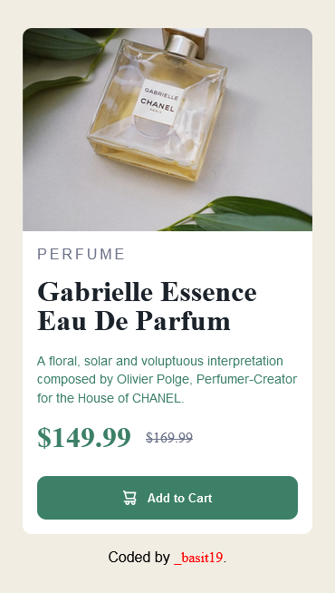
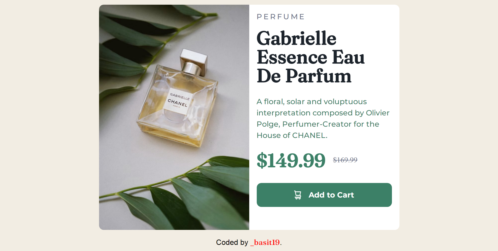

# Frontend Mentor - Product preview card component solution

This is a solution to the [Product preview card component challenge on Frontend Mentor](https://www.frontendmentor.io/challenges/product-preview-card-component-GO7UmttRfa). Frontend Mentor challenges help you improve your coding skills by building realistic projects.

## Table of contents

- [Frontend Mentor - Product preview card component solution](#frontend-mentor---product-preview-card-component-solution)
  - [Table of contents](#table-of-contents)
  - [Overview](#overview)
    - [The challenge](#the-challenge)
    - [Screenshot](#screenshot)
    - [Links](#links)
  - [My process](#my-process)
    - [This was Built with](#this-was-built-with)
  - [Author](#author)

## Overview

### The challenge

This challenge was to build out this product preview card component and get it looking as close to the design as possible(a prototype).

Users should be able to:

- View the optimal layout depending on their device's screen size,
- See hover and focus states for interactive elements.

### Screenshot

_`Mobile layout`_

_`Desktop layout`_

### Links

- Solution URL: [Add solution URL here](https://your-solution-url.com)
- Live Site URL: [Add live site URL here](https://your-live-site-url.com)

## My process

I started by setting up the project where I put all my images in a folder
`/images`. After setting the project up, I started designing for `Desktops`. This make it easy write for `Mobiles` as the the layouts didn't differ from each other that much.

I started with the markup - `HTML5` wrapping all elements in the `main` element with a class of `.product-card` which I used for styling. Contents in the `<main>` are also group into two sections using the `section` element with classes `.product-card__left`, `.product-card__right` respectively for first section and second section.

`.product-card__left` has no other element but it's that will contain our images. That will be done use `CSS3`. `.product-card__right` will contain the text elements with classes for use in the stylesheet.

Pure `CSS3` was used for styling using topdown approach.
You can find the source code [here](www.github.com/abdulbasitosman).

### This was Built with

- Semantic HTML5 markup
- CSS custom properties
- Flexbox
- CSS Grid

## Author

- Instagram - [@osmanbasit20](https://www.instagram.com/osmanbasit20/)
- Frontend Mentor - [@abdulbasit1995](https://www.frontendmentor.io/profile/abdulbasit1995)
- Twitter - [@\_basit19](https://www.twitter.com/_basit19)
